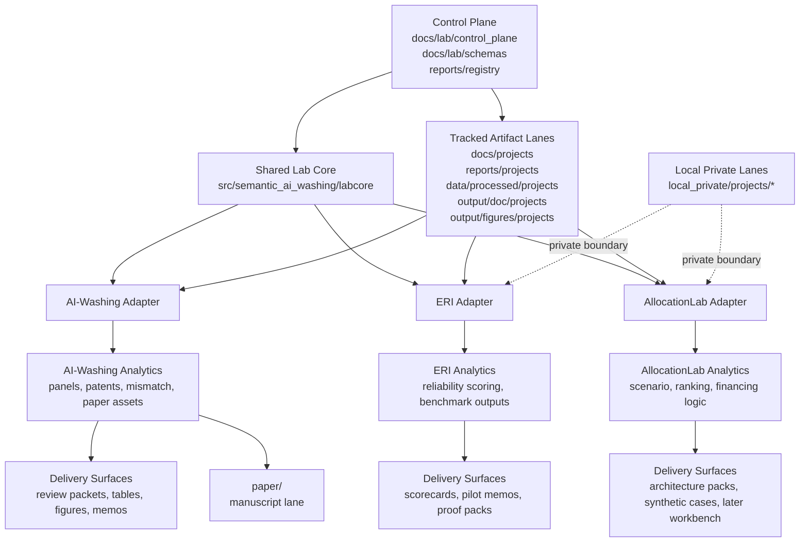

# Lab End-State Architecture Review V1

## Purpose

This note pauses the migration after the first shared-helper round and answers a practical question:
what should this repository look like when the restructure is mature enough to operate as a real multi-program lab?

The point is not to imagine a polished SaaS platform.
The point is to define the end-state shape clearly enough that future migration waves can move faster without creating structural drift.

## Bottom line

The mature repo should behave like a monorepo lab with five explicit operating layers:
- control plane
- shared evidence core
- project adapters
- downstream analytics modules
- delivery surfaces

The end-state is not:
- one giant project-specific tree with extra folders
- three projects living side by side with no contracts
- a speculative neutral platform that hides domain differences

The end-state is:
- one controlled lab kernel
- one small shared core
- several bounded project adapters
- shared patterns for delivery and QA
- project-specific semantics preserved where they belong

## The mature operating picture

### Layer 1. Control plane

This layer tells the lab what is authoritative, current, allowed, and safe.

It owns:
- boundary memos
- source-of-truth policy
- artifact policy
- project registry
- schemas for shared contracts
- migration maps
- acceptance gates and promotion rules
- private-vs-tracked lane rules

Tracked home:
- `docs/lab/control_plane/`
- `docs/lab/schemas/`
- `reports/registry/`

### Layer 2. Shared evidence core

This layer owns shared contracts and low-level mechanics that are truly reusable across projects.

It should grow only when reuse is proven.

Current seed already visible in `labcore/`:
- registry helpers
- runtime helpers
- audit helpers
- security helpers
- OpenAI Responses transport helpers

Later likely residents:
- manifest contracts
- evidence-unit contracts
- evaluation payload contracts
- delivery/export payload contracts

Tracked code home:
- `src/semantic_ai_washing/labcore/`

### Layer 3. Project adapters

This layer is where domain meaning lives.

Each adapter should own:
- corpus boundary
- taxonomy / rubric
- benchmark design
- scoring semantics
- downstream project-facing outputs

Near-term adapters:
- `ai_washing`
- `eri`
- `allocationlab`

The adapters should reuse shared core without flattening domain differences.

Conceptual code home:
- `src/semantic_ai_washing/adapters/<project>/`

Tracked docs home:
- `docs/projects/<project>/`

### Layer 4. Analytics modules

This layer converts evidence and scores into domain-relevant analysis.

Examples:
- patent timing, mismatch, market tests, and paper tables for AI-washing
- reliability aggregation and scorecards for ERI
- ranking, scenario, and financing logic for AllocationLab

This is the layer where project divergence should remain largest.

### Layer 5. Delivery surfaces

This layer turns outputs into forms people can use.

Examples:
- paper support packets
- technical memos
- review packets
- proof demos
- partner-ready summary packs
- dashboards or workbenches later

The delivery layer should share patterns, not force identical outputs.

## End-state repo graph

## What the repo should feel like when this is working

A new contributor should be able to answer these quickly:
- what is shared core vs project-specific?
- where does a new artifact go?
- what is authoritative right now?
- what remains local-private?
- what can be reused across programs safely?
- what still belongs to AI-washing only?

If those answers are still ambiguous, the restructure is not mature enough.

## What stays explicitly out of scope

Even in the mature Lab MVP state, the repo should still avoid pretending it is:
- a finished platform product
- a fully neutral package namespace
- a general-purpose ML platform
- a real-time multi-tenant service
- a reason to erase project-specific semantics

Also still out of scope for this repo phase:
- major package rename
- multi-repo split
- heavy infrastructure layers for their own sake
- forced adapter implementation before charter and staffing exist

## What is likely to change next in code shape

The most plausible next code-level steady state is:
- `director/` remains orchestration and control discipline
- `labcore/` grows into shared contracts and low-level reusable primitives
- `adapters/` appears once one or more projects need real code-side boundaries
- old flat project-specific modules remain until replacement ownership is clear

That means the end-state is not a rewrite.
It is a controlled migration toward visible layers.

## Design implication for the next rounds

Now that the low-level helper round is done, the best acceleration does not come from extracting more helpers blindly.
It comes from:
- codifying shared contracts
- creating adapter-side namespaces only where needed
- migrating in small parallel batches with explicit gates

## Bottom line

The mature repo should look like a real lab:
- one control plane
- one small shared core
- multiple bounded adapters
- project-specific analytics
- shared delivery patterns

That is the structure that lets three or more programs coexist without turning the repo into another pilot-stage sprawl.
