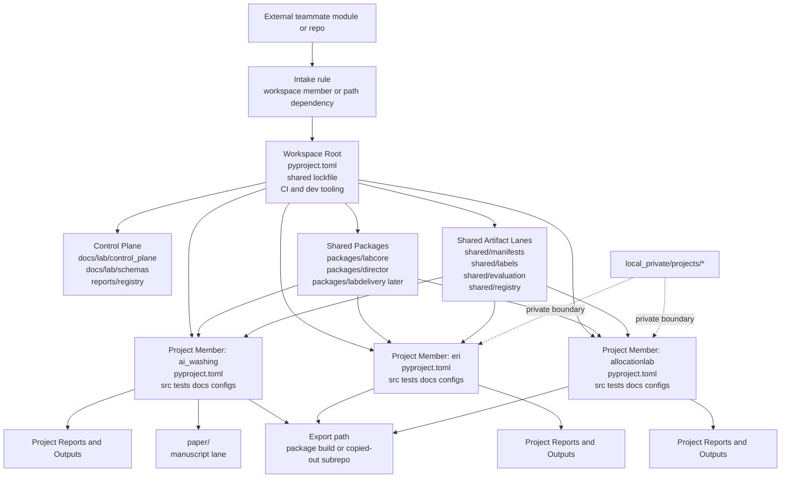

# Lab End-State Architecture Review V2

## Purpose

This note revises the earlier end-state architecture after a deeper look at:
- the first low-level shared-helper round
- the current lab control-plane work
- package-oriented monorepo patterns
- an external private architecture example reviewed only for abstract structural lessons

The main reason for the revision is simple:
the earlier end-state still assumed a repo that was too centered on one shared project tree.

That is good enough for a controlled pilot.
It is not good enough for a lab that must:
- absorb another coder's module or repo with low friction
- let a project live as a coherent standalone work unit
- allow a subpackage or subproject to be copied out, published, or sold later with minimal surgery

## Bottom line

The end-state should no longer be thought of as:
- one monorepo with one dominant package tree plus some extra project folders

The end-state should be thought of as:
- one workspace monorepo
- several shared infrastructure packages
- several project mini-repos inside that workspace
- one control plane above them
- one shared artifact/evidence layer beside them

In other words:
- the lab remains one repository
- but the major projects should behave more like independent workspace members than like subfeatures of one project

## Why the V1 picture is no longer enough

The earlier end-state review got the layers right:
- control plane
- shared core
- adapters
- analytics
- delivery

But it was still too centralized around one repo-wide `src/`, one repo-wide docs concept, and one repo-wide project package story.

The new requirement changes that:
- different teammates may work in their own repos and send you coherent modules
- those modules should be absorbable with minimal restructuring
- major project lanes should be exportable later with minimal cutting

That pushes us toward a stronger structure:
- shared infrastructure should stay shared
- project programs should become self-contained workspace members
- package boundaries should be coarse and durable, not micro-modular and fragile

## Lessons learned, abstracted

The private architecture reference reinforced four useful lessons:

1. teammate ownership works best when each contributor owns a coherent module, not scattered functions
2. modules can stay independent while still plugging into shared infrastructure and shared downstream surfaces
3. analytics, integration, and delivery can be separate layers without forcing every detail into one central core
4. the right replacement unit is a module or package, not an individual helper function

That fits the lessons from this repo too:
- small shared helpers are useful
- but deep cross-cutting function reuse creates upgrade drag
- package-level boundaries are safer than overly granular shared logic

## Recommended end-state model

The best end-state for this repo is a package-centric workspace monorepo.

### What stays centralized

Centralized at repo root:
- control plane
- shared contracts and schemas
- shared artifact and evidence lanes
- shared infrastructure packages
- root workspace tooling and lockfile

### What becomes self-contained

Each major program should become a self-contained workspace member with its own:
- `pyproject.toml`
- `README`
- `src/`
- `tests/`
- `docs/`
- `configs/`
- project-local reports/output conventions

Near-term project members:
- `ai_washing`
- `eri`
- `allocationlab`

### What becomes shared packages

Shared packages should be few and stable:
- `labcore`
- `director`
- later, possibly `labdelivery` or a similar delivery/export package if reuse proves real

These should not absorb project semantics.

## Three architectural options

### Option A. Keep the current centralized monorepo shape

Pros:
- least immediate migration work
- easiest short-term continuity

Cons:
- weak project-level isolation
- weak absorb/export story
- still too dependent on one large shared package tree

Verdict:
- not strong enough for the long-term lab target

### Option B. Workspace monorepo with package-style project members

Pros:
- supports one repo with many coherent subprojects
- strong path for teammate module intake
- strong path for later package export
- keeps one control plane and one shared lock/tooling layer
- preserves shared infrastructure where it truly belongs

Cons:
- more upfront structure work
- requires stronger contracts
- forces clearer boundaries than the repo currently has

Verdict:
- recommended

### Option C. Fully federated multi-repo system now

Pros:
- strongest project isolation
- easiest independent release story

Cons:
- too early
- too much operational overhead
- would slow the current transition

Verdict:
- not yet

## Revised layered picture

### Layer 1. Control plane

Owns:
- boundary memos
- source-of-truth policy
- artifact policy
- registry views
- schemas
- migration notes
- acceptance gates

Tracked home:
- `docs/lab/control_plane/`
- `docs/lab/schemas/`
- `reports/registry/`

### Layer 2. Shared infrastructure packages

Owns:
- orchestration
- low-level runtime
- audit/security/transport primitives
- shared contracts once stabilized

Expected home:
- `packages/labcore/`
- `packages/director/`
- later, possibly `packages/labdelivery/`

### Layer 3. Shared artifact and evidence lanes

Owns:
- manifests
- labels
- shared evaluations
- shared registries
- reusable templates or delivery primitives that are not project-private

Expected home:
- `shared/manifests/`
- `shared/labels/`
- `shared/evaluation/`
- `shared/registry/`

### Layer 4. Project workspace members

Owns:
- domain corpus rules
- taxonomy/rubric
- benchmark design
- scoring semantics
- project-specific outputs

Expected home:
- `projects/ai_washing/`
- `projects/eri/`
- `projects/allocationlab/`

### Layer 5. Project delivery surfaces

Each project should be able to produce:
- internal reports
- proof artifacts
- export packs
- later, possibly a publishable or client-shareable package or copied-out repo

For AI-washing specifically:
- `paper/` remains a distinct manuscript lane and should not be flattened into generic delivery

## Revised end-state repo graph

## Design rules for this model

### Rule 1. Package boundaries should be coarse

Do not make every reusable function part of shared infrastructure.

Promote only:
- stable contracts
- low-level helpers
- shared infrastructure primitives

Keep project business logic inside project members unless reuse is durable and proven.

### Rule 2. Integration should happen through declared dependencies

Project members should consume shared packages through explicit dependencies.
They should not rely on deep, informal imports into one another's private internals.

### Rule 3. Exportability is a design requirement

Each project member should be able to:
- build as a coherent package
- be copied into a new repo with limited path surgery
- keep its own README, docs, tests, and configs

### Rule 4. Intake should be a first-class design path

Another coder's contribution should be absorbable in one of two ways:
- as a new workspace member
- or first as a path/git dependency that can later be promoted into the workspace

### Rule 5. Shared lanes are for cross-project assets, not everything

Not all data, docs, reports, or outputs should live in shared root-level folders.
Only cross-project or control-plane assets belong there.

## Packaging and tool implications

The research strongly suggests a few practical implications:

- A workspace tool is a good fit here because it supports multiple packages in one repo with separate package metadata and shared tooling.
- If members stay compatible enough, one shared workspace lockfile is an advantage.
- If a member needs divergent requirements, path dependencies or looser integration may be safer than forcing everything into one workspace rule.
- Native namespace packages and plugin systems are available, but they come with caveats and should be used carefully.

My recommendation is:
- do not make the whole lab depend on one giant top-level namespace package
- prefer explicit workspace members with their own package names
- use plugin or namespace patterns only where extensibility is truly needed

## Public references that shaped this revision

- uv workspaces:
  - https://docs.astral.sh/uv/concepts/projects/workspaces/
- Pants monorepo rationale:
  - https://www.pantsbuild.org/2.26/docs/introduction/welcome-to-pants
- Python packaging namespace packages:
  - https://packaging.python.org/en/latest/guides/packaging-namespace-packages/
- Python packaging plugin discovery:
  - https://packaging.python.org/en/latest/guides/creating-and-discovering-plugins/
- setuptools package discovery and `src` layout cautions:
  - https://setuptools.pypa.io/en/stable/userguide/package_discovery.html

## Bottom line

The repo should still become a lab.
But the right mature form is now clearer:

- one control plane
- a few shared infrastructure packages
- a few shared artifact lanes
- several package-style project members
- one export/intake path for modules

That is a better long-term shape than a single shared package tree with projects attached to it.
